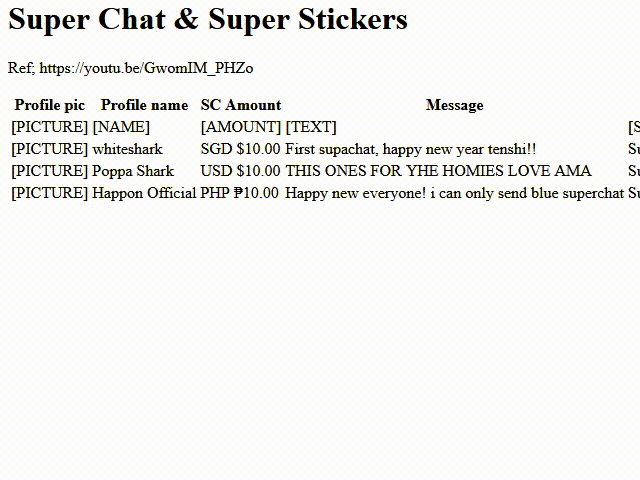

# Super Chat Buddy

Just point with your mouse to a written amount of money, preferably on Youtube. The program picks up what you are aimin' at!  
The money amount is used to calculate a corresponding super chat color. 60% of the time works every time!

## Components

1. (C#-WPF) Managed app for providing overlay information.

## How does it work

The application acts as an accessibility client, like a screen reader, and processes structural information from text renderers like your browser.

## FAQ

### But?! This is spyware!

Theoretically, yes. This program processes information from your topmost windows. There are no tricks or hacks employed, all processed data 
is provided by your (compatible) programs. This also means that no information gets recorded from privileged and elevated processes, like Task Manager.  
It doesn't send your information anywhere because that's not a cool thing to do!

### Will running this program affect my computer performance?

It shouldn't. The processing pipeline is written in such a way to work as little as possible. Should you encounter a negative performance impact, let me
know [by leaving a remark on a new Github issue](https://github.com/Bert-Proesmans/SC-Buddy/issues/new)!

### My question isn't listed!

Ask again to make it occur more frequently. Thanks!